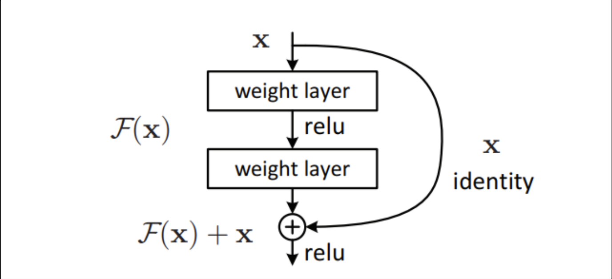
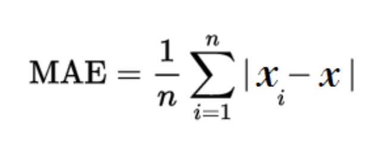

 <h1> :star:𝐏𝐫𝐨𝐣𝐞𝐜𝐭: Parameter Estimation in Multi-standard Wideband Receivers via Deep Learning. </h1> 

 <h3> 𝐀𝐝𝐯𝐢𝐬𝐨𝐫: Sumit J Darak</h3> 

 <h3> <a href="https://www.linkedin.com/in/mohdahmad242/">Mohammad Ahmad</a>, Shivam Chandhok, Himani Joshi</h3> 

## Data Description:

Dataset has been generated using MatLab. 

* We took two different approaches for our problem, Parameter Estimation in Multi-standard Wideband Receivers at Nyquist rate and Sub-Nyquist rate.
* Eight antennas were used to generate the dataset for both Nyquist and sub-Nyquist rates.
* Different numbers of observations were used to generate the dataset, 100, 200, and 300 for the Nyquist rate and 10, 20, and 30 for the Sub-Nyquist rate.
* A total of 100,000 samples were used in this project.
* The final input shape was 8x100x100000, where 8 is the number of antennas, 100 is the number of observations, and 100000 number of samples.
* Dataset was divided into 85:15 ratio for training and testing.
* Each data point in the dataset was a complex number and the target value was an integer.
* Target values range from 0 to 180, so the dataset was distributed over 181 classes.
* The dataset was generated with a different Signal-to-noise(SNR) ratio.
* Total 5 different SNR values were chosen 0dB, 10dB, 20dB, 30dB, and 40 dB.
* Dataset was also generated based on the number of DOA’s(target value), from 1 to 7 DOAs were used in the dataset.

The final number of datasets was generated.

* A total of 5 different datasets were generated per DOA value based on different SNR values.
* A total of 35 different datasets were generated per observation values based on different DOA values.
* Finally, a total of 210 different datasets were curated for the project.
    * Nyquist rates
        * 35 datasets for 100 observations. (1.2 GB each)
        * 35 datasets for 200 observations. (2.5 GB each)
        * 35 datasets for 300 observations. (3.7 GB each)
    * Sub-Nyquist rate
        * 35 datasets for 10 observations. (123.1 MB each)
        * 35 datasets for 20 observations. (246.1 MB each)
        * 35 datasets for 30 observations. (369.3 MB each)

## Technical Aspects & Details:

### Pre Processing:

A few pre-processing techniques were used before training

* As each data point in the dataset was complex, the Deep learning model does not take a complex number as input, 
* So we divided our data points into three different channels to preserve the information.
    * The real value of complex number ( Channel 1)
    * Complex value of complex number ( Channel 2)
    * Phase value of complex number calculated using cmath library ( Channel 1) 
* We also tried normalizing the values.

### Architecture: 

Explored different architecture for DOA classification. Some of them are listed in the table below. 

<table>
  <tr>
   <td><strong>Architecture</strong>
   </td>
   <td><strong>Batch size(train/test)</strong>
   </td>
  </tr>
  <tr>
   <td>Simple CNN
   </td>
   <td>64/128
   </td>
  </tr>
  <tr>
   <td>UNet + CNN 
   </td>
   <td>64/128
   </td>
  </tr>
  <tr>
   <td>Resnet 18
   </td>
   <td>64/128
   </td>
  </tr>
  <tr>
   <td>Resnet 34
   </td>
   <td>64/128
   </td>
  </tr>
  <tr>
   <td>Resnet 50
   </td>
   <td>64/128
   </td>
  </tr>
  <tr>
   <td>SqueezeNet
   </td>
   <td>64/128
   </td>
  </tr>
</table>

### Baseline:

**Multiple signal classification (MUSIC) algorithm**

MUSIC was used for baseline results. This algorithm is used for frequency estimation and radio direction finding. MUSIC is a generalization of [Pisarenko's method](https://en.wikipedia.org/wiki/Pisarenko_harmonic_decomposition), and it reduces to Pisarenko's method. Pisarenko's method, only a single eigenvector is used to form the denominator of the frequency estimation function; and the eigenvector is interpreted as a set of [autoregressive](https://en.wikipedia.org/wiki/Autoregressive_model) coefficients, whose zeros can be found analytically or with polynomial root finding algorithms. In contrast, MUSIC assumes that several such functions have been added together, so zeros may not be present. Instead there are local minima, which can be located by computationally searching the estimation function for peaks.

**Resnet 34:**

Residual Network is a specific type of neural network that was introduced in 2015.

When we increase the number of layers, there is a common problem in deep learning associated with that called Vanishing/Exploding gradient. This causes the gradient to become 0 or too large. Thus when we increase the number of layers, the training and test error rate also increases. 

In order to solve the problem of the vanishing/exploding gradient, this architecture introduced the concept called Residual Network. In this network we use a technique called **_skip connections_** . The skip connection skips training from a few layers and connects directly to the output.

The advantage of adding this type of skip connection is because if any layer hurts the performance of architecture then it will be skipped by regularization. So, this results in training a very deep neural network without the problems caused by vanishing/exploding gradients.  The authors of the paper experimented on 100-1000 layers on the CIFAR-10 dataset.

There is a similar approach called “highway networks”, these networks also use skip connections. Similar to LSTM these skip connections also use parametric gates. These gates determine how much information passes through the skip connection. This architecture however  has not provided accuracy better than ResNet architecture.

Final architecture of Residual Network.

### **Losses used in training of Resnet:**

* Since the problem we are solving is multi class multi label problem, here the target ranges from 1 to 7 and the dataset is distributed over 181 classes.
* First, we used Cross entropy loss for training.
* After training the Resnet architecture for 50 epochs, a general trend was seen: the loss for lower SNR started increasing rather than decreasing after 23-25 epochs.
* This is due to overfitting of models at lower SNR.
* So, we used the second loss, Focal loss. We applied the Focal loss after 20th epochs to curb the problem of overfitting at lower SNR.

**Focal Loss:**

* 

**Metrics used for evaluation of test set:**

* Two different metrics were used for evaluation of test set:
    * Mean absolute error
    * Accuracy
* First, we will discuss the training and testing methodology.
    * Training and testing sets were divided in 85:15 ratio, of which the training set was mixed with different SNR values for the same target value. But at testing phase dataset with different SNR values validated separately.
    * This way our model was generalized for different SNR values. 
* Mean absolute error: 

* Accuracy:

# Results
***
Accuracy vs DOA (SNR - 0dB)           |  Accuracy vs DOA (SNR - 30dB)
:-------------------------:|:-------------------------:
.png) | .png)
Accuracy vs SNR (DOA - 3)          |  Accuracy vs SNR (DOA - 6)
:-------------------------:|:-------------------------:
.png) | .png)
MAE vs DOA (SNR - 0dB)           |  MAE vs DOA (SNR - 30dB)
:-------------------------:|:-------------------------:
.png) | .png)
MAE vs SNR (DOA - 3)         |  MAE vs SNR (DOA - 6)
:-------------------------:|:-------------------------:
.png) | .png)
| MAE vs DOA (SNR - 30dB) DL Only |
:-------------------------:|
_DL_only.png)

